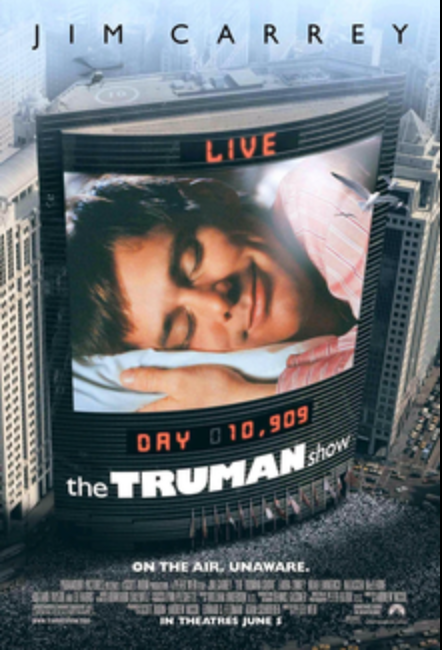
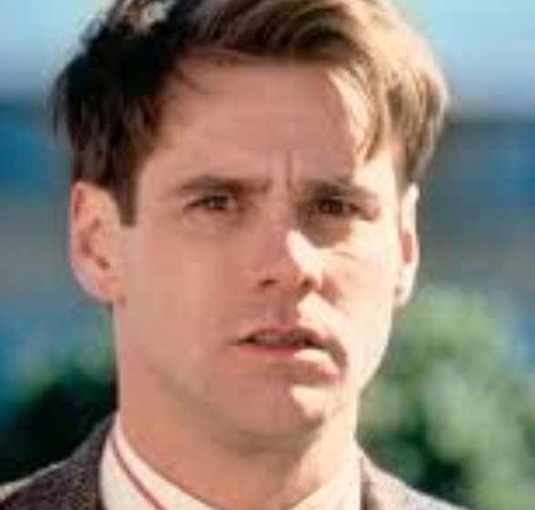
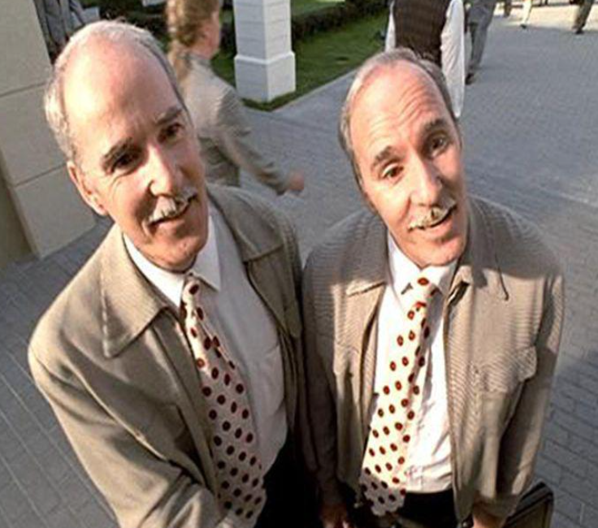

<html>
<head>
    <title>The Truman Show</title>
</head>
<body>
    <a href="Assign1.html">As1 - Movies</a>
   <a href=”assign2.html”>Assignment 2 - Movie Profiles</a>

    <h1>The Truman Show</h1>
    
    
Truman Burbank doesn't realize his entire life is a reality TV show filmed inside a giant TV studio. As he begins to notice strange occurrences, he becomes determined to escape and discover the truth. The film explores themes of reality, free will, and what it means to be truly free.

    
I love this movie because the concept is so creative and mind-bending. Jim Carrey's performance is both funny and touching. The ending really makes you think about reality and choice.

 

Christof acts like a total control freak who runs Truman's whole life as a fake TV show, caring more about good ratings than letting Truman be free.

Truman is an ordinary, unsuspecting man who slowly realizes his entire life is a staged reality TV show, and chooses to break free from the artificial world built around him

The twins are just two random guys who always show up with the same goofy smiles, acting like cheerful robots to make Truman's fake town look happy and normal

Truman's wife Meryl is just an actress pretending to love him, always smiling like a npc and shoving random products into their conversations because the show's bosses tell her what to do

</body>
</html> 
